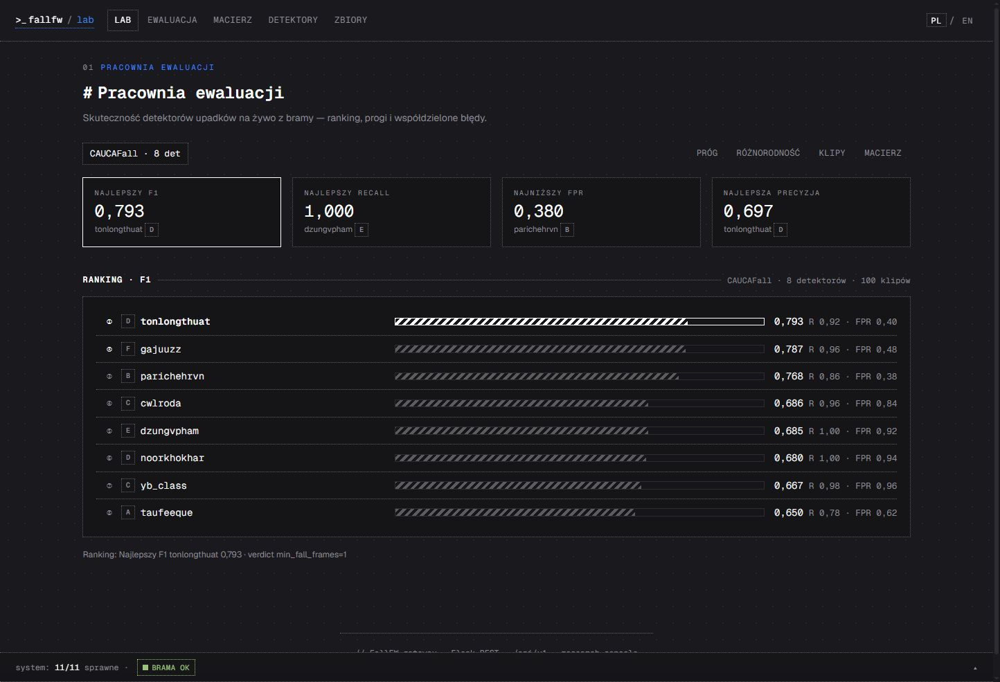
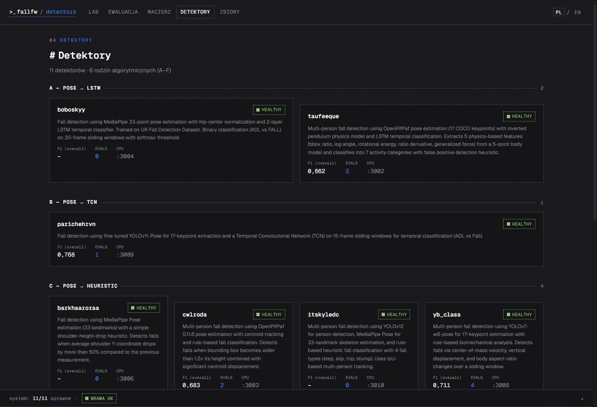
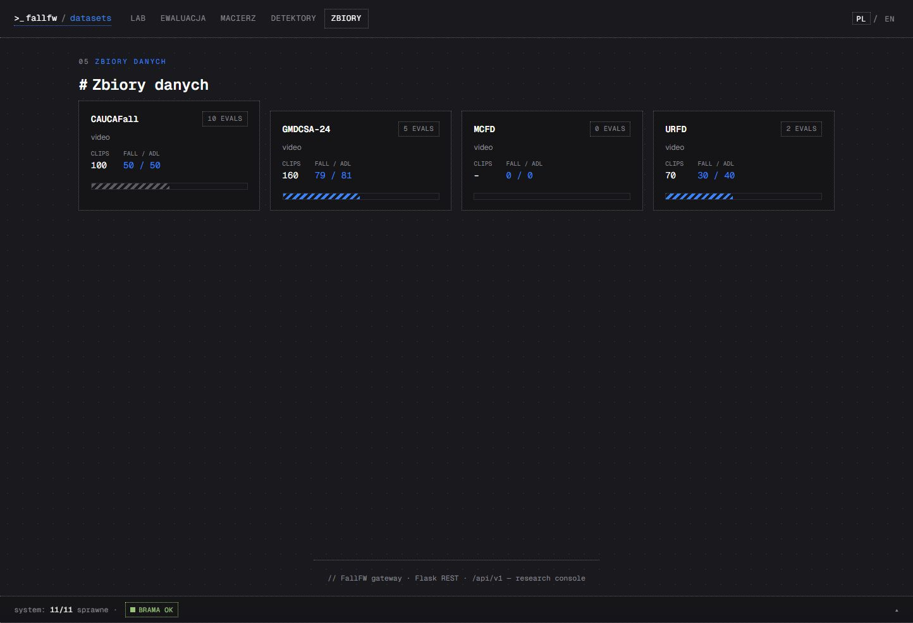

# FallFW - framework do porównywania wizyjnych detektorów upadków

Mikroserwisowy framework badawczy: każdy detektor upadków działa jako kontener
Docker z ujednoliconym REST API, dzięki czemu różne algorytmy można uruchomić na
tych samych nagraniach i uczciwie porównać - na poziomie klatek, klipów i całych
zbiorów danych. Projekt powstał na potrzeby pracy magisterskiej o generalizacji
międzyzbiorowej detekcji upadków (analiza *cross-dataset*).

Autor: Karol Bobowski

| Pracownia ewaluacji | Detektory | Zbiory danych |
|---|---|---|
|  |  |  |

## Funkcje

- ranking detektorów na żywo (F1, recall, FPR, precyzja) na wybranym zbiorze,
- analiza wrażliwości na próg agregacji `min_fall_frames` (zmiany rankingu),
- macierz międzyzbiorowa: F1 detektor × zbiór z rangami,
- miary różnorodności zespołu (kappa Cohena, double-fault, macierz współwystępowania błędów),
- mapa potencjalnego wycieku danych (train / eval / OOD dla par detektor–zbiór),
- podgląd klipów z decyzjami klatkowymi i skokiem do klatki,
- interfejs PL/EN, motyw jasny/ciemny, wbudowany samouczek.

## Szybki start

```bash
git clone https://github.com/boboskyy/fall-framework.git
cd fall-framework
python3 launch.py
```

Launcher buduje i uruchamia **Gateway** (port 3000) oraz **Frontend**
(port 2999) - otwórz http://localhost:2999.

Praca z detektorami przez CLI (opcjonalnie `pip install click requests rich simple-term-menu`):

```bash
python -m cli download --all      # pobranie kodu detektorów (GitHub Releases)
python -m cli build --all         # budowa obrazów Docker
python -m cli start <nazwa>
python -m cli detect video.mp4 -d <nazwa> --sync
```

Tryb interaktywny: `python -m cli` (nawigacja strzałkami).

## Detektory (11, sześć kategorii metod)

| Detektor | Kategoria | Technologia | Oryginalne repozytorium |
|----------|-----------|-------------|------------------------|
| boboskyy_fall_detect | A - poza + LSTM | MediaPipe + LSTM | [archiwum](https://github.com/boboskyy/fall-detector-repos) |
| taufeeque_human_fall | A - poza + LSTM | OpenPifPaf + LSTM | [taufeeque9/HumanFallDetection](https://github.com/taufeeque9/HumanFallDetection) |
| parichehrvn_tcn_fall | B - poza + TCN | YOLOv11-Pose + TCN | [parichehrvn/fall_detection](https://github.com/parichehrvn/fall_detection) |
| barkhaaroraa_fall_detection_dl | C - poza + heurystyka | MediaPipe, spadek barków | [barkhaaroraa/health_monitoring_system_DL](https://github.com/barkhaaroraa/health_monitoring_system_DL) |
| cwlroda_openpifpaf | C - poza + heurystyka | OpenPifPaf + tracker centroidowy | [cwlroda/falldetection_openpifpaf](https://github.com/cwlroda/falldetection_openpifpaf) |
| itskyledc_yolov12_mediapipe | C - poza + heurystyka | YOLOv12 + MediaPipe, reguły | [itSkyyledc/Human-Fall-Detection-Yolov12-Mediapipe](https://github.com/itSkyyledc/Human-Fall-Detection-Yolov12-Mediapipe) |
| yb_class_fall | C - poza + heurystyka | YOLOv7-w6-pose, biomechanika | [Y-B-Class-Projects/Human-Fall-Detection](https://github.com/Y-B-Class-Projects/Human-Fall-Detection) |
| noorkhokhar_yolov8_fall | D - detekcja obiektów | YOLOv8, klasa „upadek" | [noorkhokhar99/Fall_Detection_Using_Yolov8](https://github.com/noorkhokhar99/Fall_Detection_Using_Yolov8) |
| tonlongthuat_fall_detection | D - detekcja obiektów | YOLOv8-pose, klasa „fall" | [tonlongthuat/Real-Time-Fall-Detection](https://github.com/tonlongthuat/Real-Time-Fall-Detection) |
| dzungvpham_twostream_cnn | E - dwustrumieniowy | MobileNetV2 + Motion History Image | [dzungvpham/fall-detection-two-stream-cnn](https://github.com/dzungvpham/fall-detection-two-stream-cnn) |
| gajuuzz_stgcn | F - graf szkieletu (GCN) | AlphaPose/SPPE + ST-GCN (TSSTG) | [GajuuzZ/Human-Falling-Detect-Tracks](https://github.com/GajuuzZ/Human-Falling-Detect-Tracks) |

Kod detektorów pobierany jest jako spakowane archiwa z
[boboskyy/fall-detector-repos](https://github.com/boboskyy/fall-detector-repos)
(GitHub Releases); wagi modeli - zgodnie z README danego detektora.

## Zbiory danych

| Zbiór | Źródło |
|-------|--------|
| URFD (UR Fall Detection) | [fenix.ur.edu.pl/~mkepski/ds/uf.html](http://fenix.ur.edu.pl/~mkepski/ds/uf.html) |
| GMDCSA-24 | [ekramalam/GMDCSA24…](https://github.com/ekramalam/GMDCSA24-A-Dataset-for-Human-Fall-Detection-in-Videos) |
| CAUCAFall | [Mendeley Data, doi:10.17632/7w7fccy7ky.5](https://doi.org/10.17632/7w7fccy7ky.5) |
| MCFD (Multiple Cameras Fall) | [iro.umontreal.ca/~labimage/Dataset](https://www.iro.umontreal.ca/~labimage/Dataset/) |

Przygotowane paczki klipów (z etykietami na poziomie klipu) framework pobiera z
GitHub Releases (`datasets-v1`); można też dodać **własny zbiór** - wystarczy
katalog z klipami wgrany przez UI (zakładka Zbiory) lub API gatewaya.

## Własny detektor

Nowy detektor to katalog w `detectors/` wg szablonu `detectors/_template`:
`manifest.json` (metadane, port), `detector.py` (adapter dziedziczący po
`BaseDetector`), `app.py`, `Dockerfile`, `requirements.txt`. Po dodaniu jest
widoczny w CLI i w UI jak pozostałe.

## Struktura projektu

```
fall-framework/
├── core/           biblioteka współdzielona (modele, BaseDetector, fabryka Flask)
├── gateway/        REST API + orkiestracja i statystyki ewaluacji (port 3000)
├── frontend/       statyczny SPA (vanilla JS) serwowany przez nginx (port 2999)
├── cli/            interfejs wiersza poleceń (Click)
├── detectors/      adaptery detektorów + szablon _template
├── shared/         wolumin współdzielony (uploady, wyniki, stan)
└── launch.py       launcher (build + up)
```
